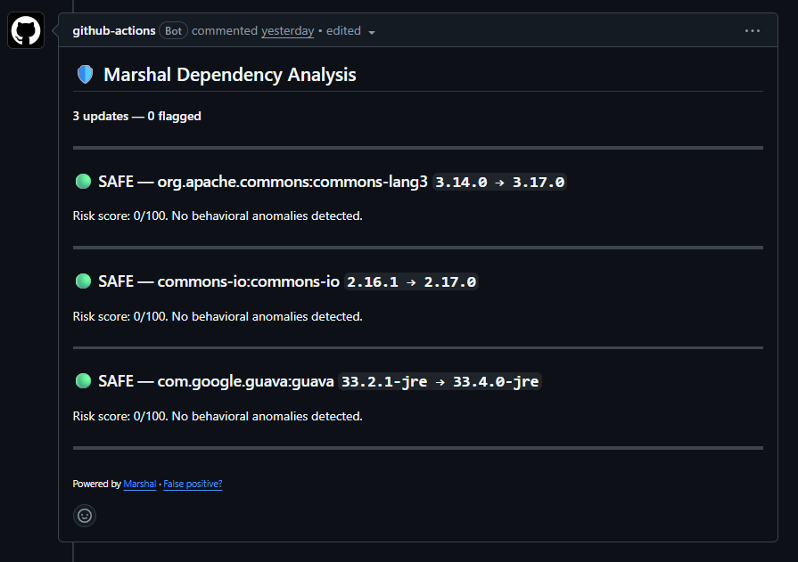

# Marshal

Behavioral supply-chain security for JVM dependencies.

Marshal watches how packages change on Maven Central and scores every update
on a 0–100 risk scale. A maintainer swap, a dropped GPG signature, a sudden
jump in dependency count: these show up the day a version is published, long
before a CVE exists. Risky updates fail your PR check with a clear reason.
It's built for Java teams on Maven that auto-merge dependency updates and
want a way to catch the bad ones before they hit the build.




*javax.activation:activation scores ORANGE 55/100 — GPG signature dropped between versions.*

## Quick start

Requires Java 21 or later to run the CLI. The GitHub Action bundles its own
runtime, so there's nothing to install on the Action path.

Add this to your repo at `.github/workflows/marshal.yml`:

```yaml
name: Marshal

on:
  pull_request:
    paths: ['pom.xml']

jobs:
  marshal:
    runs-on: ubuntu-latest
    permissions:
      contents: read
      pull-requests: write
    steps:
      - uses: actions/checkout@v4
      - name: Marshal scan
        uses: marshal-hq/marshal/marshal-action@v0.1.0
        with:
          pom-path: pom.xml
          threshold: red
          fail-on: fail
        env:
          GITHUB_TOKEN: ${{ secrets.GITHUB_TOKEN }}
```

Or run the CLI directly:

```bash
# Download
curl -fsSL https://github.com/marshal-hq/marshal/releases/download/v0.1.0/marshal-cli-0.1.0.jar \
  -o marshal.jar

# Scan a project
java -jar marshal.jar scan --pom pom.xml
```

## Using Marshal

**On a pull request (recommended).** Add the workflow above. On every PR that
touches `pom.xml`, Marshal scans the dependency changes and posts a comment
with any findings. Set `fail-on: fail` with `threshold: red` to block merges
on critical findings, or set `fail-on: never` to comment without blocking.
Safe updates pass silently.

**Locally, before you commit.** Scan any project from the command line:

```bash
java -jar marshal.jar scan --pom pom.xml
```

Pick an output format depending on where the result goes:

```bash
java -jar marshal.jar scan --pom pom.xml                 # human-readable terminal output
java -jar marshal.jar scan --pom pom.xml --output json   # for CI and scripting
java -jar marshal.jar scan --pom pom.xml --output md      # markdown, e.g. for PR comments
```

Marshal exits with a non-zero code when a finding reaches your `fail-on`
threshold, so it drops into any CI pipeline, not just GitHub Actions.

## What it catches

| Signal | What it means |
|--------|---------------|
| Signature dropped | Package was GPG-signed in prior releases, now it's not |
| Missing signature | This release has no GPG signature |
| New maintainer | Different signing key or publisher account from prior version |
| Dependency explosion | Dependency count grew more than 3× in one release |
| Major version jump | Version jumped by more than 2 major versions |
| Repo URL changed | Source repository URL is different from prior version |
| Yanked version | Package was yanked or retracted after publication |

Each update gets a 0–100 risk score. Risky findings show up as a PR comment
with the evidence and a recommendation.

## Real-world coverage

Five historical supply-chain attacks are in the test suite as replay fixtures,
each reconstructed from metadata that was visible at the time:

**event-stream (npm, 2018):** A new maintainer published a version with a
malicious dependency (flatmap-stream) and no GPG signature. The NEW_MAINTAINER
and DEPENDENCY_EXPLOSION signals fire, scoring ORANGE at 60 points.

**ua-parser-js (npm, 2021):** Account takeover. The attacker published from a
different key. NEW_MAINTAINER and SIGNATURE_DROPPED fire, scoring RED.

**node-ipc protestware (npm, 2022):** The legitimate maintainer added a
destructive payload, dependency count ballooned, and the version was later
yanked. SIGNATURE_DROPPED, DEPENDENCY_EXPLOSION, and YANKED_VERSION fire.

**PyTorch-nightly dependency confusion (2022):** A malicious package was
published to PyPI before the legitimate one. First publish with no signature
and later yanked: MISSING_SIGNATURE and YANKED_VERSION score YELLOW.

**XZ Utils (2024):** Slow social engineering over two years. Marshal would have
caught the initial maintainer handoff (NEW_MAINTAINER, partial signal), but the
attacker spent months earning trust before introducing the backdoor, which is
exactly the kind of thing static behavioral signals miss. Worth being honest
about: this is a limit of the approach, not a case the tool handles.

## How it works

1. **WATCH:** Marshal fetches version history and metadata for every dependency
   in your project from Maven Central.
2. **ANALYZE:** Each new version is scored against 7 behavioral signals:
   maintainer changes, signature drops, dependency explosions, and more.
3. **BLOCK:** Risky updates fail your PR check with a clear reason. Safe
   updates pass silently.

## What Marshal is not

Marshal is not a CVE scanner. It doesn't look up known vulnerabilities, and it
isn't trying to. Snyk, Dependabot, and OWASP Dependency-Check already handle
that. What they can't see is the malicious update that nobody has reported yet,
because there's no CVE on day zero. That's the gap Marshal fills. Keep your CVE
scanner. Add Marshal next to it.

## Configuration

Place `marshal.yml` at your project root to customize behavior:

```yaml
rules:
  disabled: []
  overrides: {}

thresholds:
  fail-on: red      # red | orange | yellow
  warn-on: orange

allowlist:
  packages: []
    # - "org.springframework:*"

notifications:
  slack:
    webhook: ${MARSHAL_SLACK_WEBHOOK}
    min-level: red
```

Full reference: [examples/marshal.yml](examples/marshal.yml). Rules can be
disabled individually. Allowlisted packages are skipped entirely. Slack alerts
fire when findings reach or exceed `min-level`.

## Status

Marshal is in early development (v0.1.0). The detection engine covers Maven
Central with 7 behavioral rules. Gradle is coming soon, with npm and PyPI
after that.

What works:
- CLI scanning of Maven (pom.xml) projects
- GitHub Action with PR comments
- Risk scoring with configurable thresholds
- Slack alerts on critical findings

What's next:
- Gradle build file support (build.gradle, build.gradle.kts) — coming soon
- Transitive dependency resolution (currently direct deps only)
- npm ecosystem support
- PyPI ecosystem support
- Hosted continuous watching (SaaS)

## License

Apache 2.0. See [LICENSE](LICENSE).

## Links

- Website: [marshalhq.dev](https://marshalhq.dev)
- Twitter: [@marshal_hq](https://x.com/marshal_hq)
- Issues: [GitHub Issues](https://github.com/marshal-hq/marshal/issues)